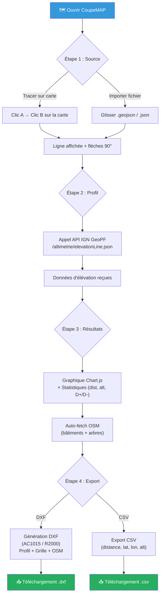
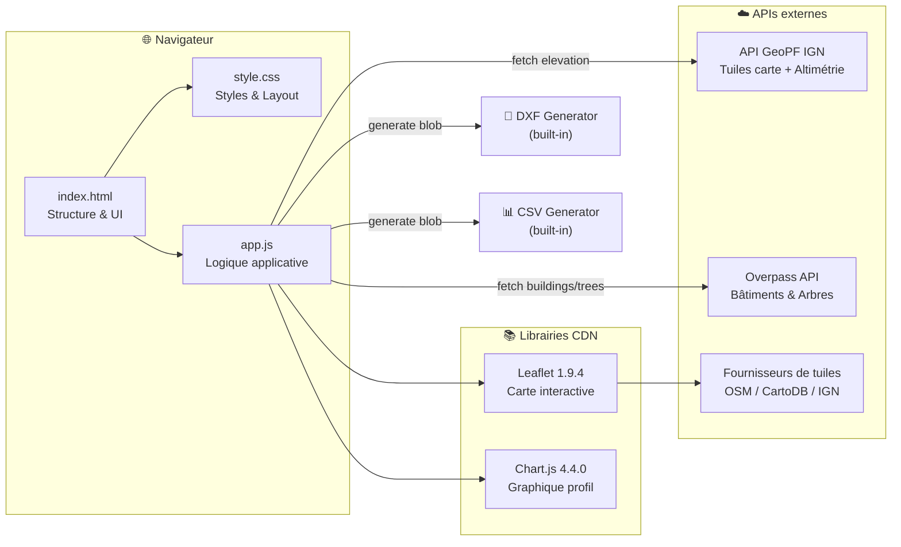
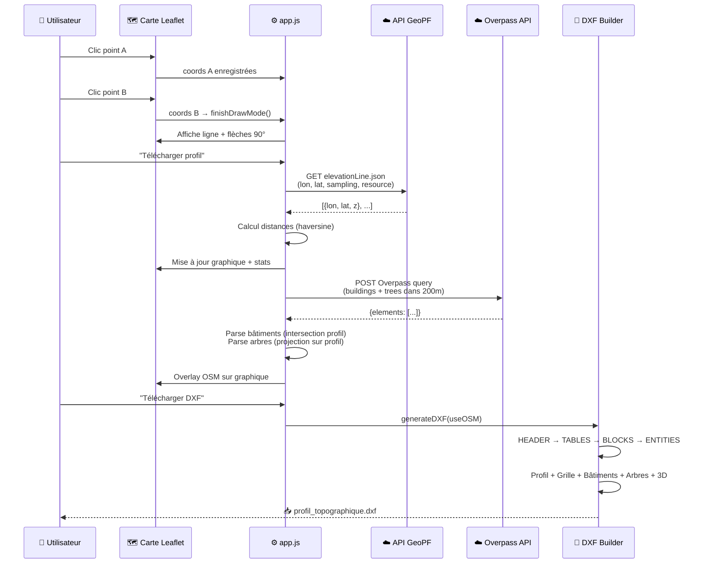
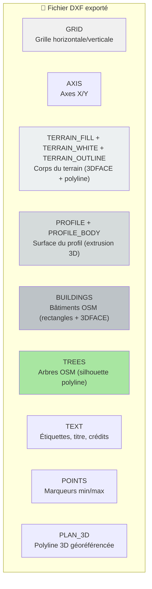
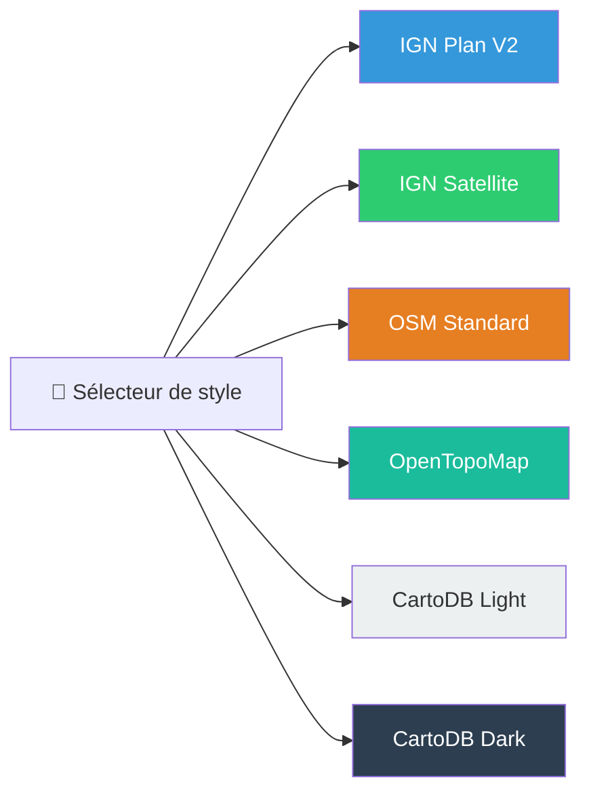

# Architecture — CoupeMAP

## Vue d'ensemble

CoupeMAP est une application web 100% statique (HTML + CSS + JS) qui génère des coupes topographiques (profils altimétriques) à partir d'une ligne tracée sur une carte interactive, puis les exporte en DXF pour utilisation dans des logiciels de CAO/BIM (ArchiCAD, AutoCAD, etc.).

---

## Diagramme de flux utilisateur

---

## Diagramme de composants

---

## Pipeline de données

---

## Structure des couches DXF

---

## Styles de carte disponibles

